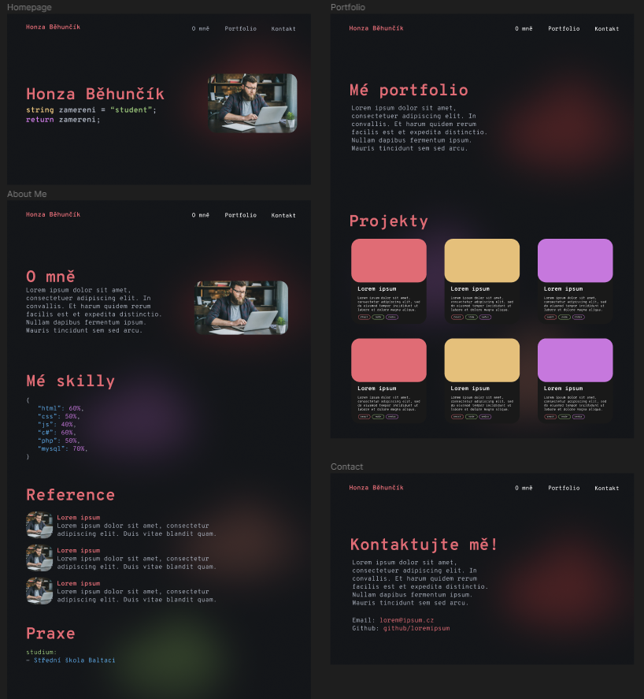

# Dokumentace k webovému portfoliu
- Vývojářské portfolio inspirováno designem různých IDE na základě syntax highlighting.
- Portfolio bylo vytvořeno pomocí technologie React v rámci školního projektu.

## Struktura webu
* **Homepage** – obsahuje základní informace (jméno, job, obrázek, navbar)
* **O mně** – obsahuje základní informace o mně, skill bar na základě data.js, automatické reference z data.js
* **Portfolio** – v portfoliu se nachází dynamický seznam včetně rozpoznávacího systému, který na základě použité technologie přiřadí danou badge. Projekty je možné kdykoliv přidat/odebrat
* **Kontakt** – na závěr jsou stanoveny mé kontaktní údaje, GitHub, LinkedIn, Instagram, Threads. Linky lze přizpůsobit také v data.js

## Používaná technologie
- **React**
- **Node.js**
- **Bootstrap library**
- **Framer Motion**
- **Animated Cursor**
- **Type Animation**
- **Vercel**

## Příležitosti ke zlepšení
- **Kontaktní formulář** – možnost plně funkčního kontaktního formuláře odesílající zprávy prostřednictvím emailu
- **Kompletní responzivita** – responzivní navbar
- **Design improvement** – přidání dalších themes, aplikace themes na blur light
- **Přidání dalších pages** – projekty je možné přidat na oddělené pages, případně přidat blog

## Závěr
- Práce s technologií React mě zaujala. Líbí se mi, jakým způsobem React pracuje se strukturou webu.
- Nejtěžší bylo si asi poradit s responzivitou webu a se stylizací v rámci Bootstrap knihovny. Často docházelo k přepisování stylů z důvodu vyšší priority Bootstrap stylů, což práci jenom přidává a to nikdo přece nechce. :)
- S jistotou ale můžu říct, že s tímto frameworkem nepracuji naposled.

# Návrh webového designu v aplikaci Figma
- Design výsledné stránky jsem se snažil dodržet podle návrhu ve Figmě.
- Během vývoje jsem ale došel k závěru, že by bylo dobré některé věci vylepšit a tak jsem implementoval některé další funkce do výsledného webu a myslím, že výsledný web mnohem více odpovídá myšlence vývojářského portfolia.
- Základní struktura byla dodržena.

